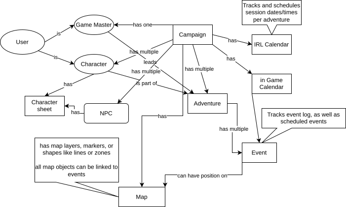
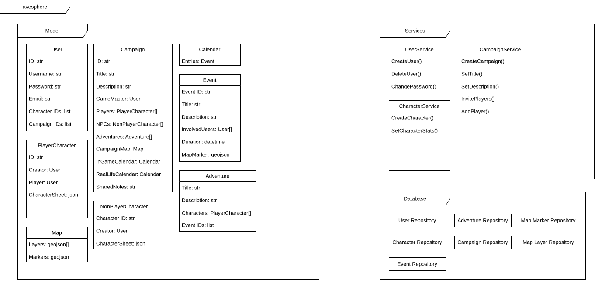

This file contains first concepts for development of the application.

# Mind Map
The following mind map shows first thoughts on System relations.

# First User Story Ideas

**U1**
As a User, I should be able to create/delete a campaign as the game master and invite other users as players. Completed Campaigns can be archived.

**U2**
As a User, I should be able to create/delete characters and join existing campaigns as a player.

**U3**
As the Game master, I want to create adventures in a campaign and add characters to it.

**U4**
As the game master, I want to prepare notes for future sessions of adventures, which are hidden from the players. 

**U5**
As a player in a campaign, I want to see/edit my character sheet and write notes for my character.

**U6**
As a player, I want to add new characters to a campaign if I want to switch my character or play multiple.

**U7**
Players and Game masters have access to a map, on which they can place markers. Game masters can hide markers from players.

**U8**
Players and Game masters can schedule and track/take notes on sessions on a real life calendar.

**U9**
Players and Game masters can track and take notes on adventures and in game events on an in game calendar. In game events can be linked to locations on the map.

**U10**
As a User, I want to create characters as NPCs and add them to campaigns where I am the game master.

**U11**
When creating or editing a Character, I should have access to selections of abilities, advantages etc. as either defined by a user before, or scraped from the rule wiki.

**U12**
As a user, I want to be able to share my characters and NPCs with other Users, for them to use. (With creator credited)

# System Architecture
Based on this, we can more concisely think about classes and methods necessary to implement these ideas.

# Tech Stack
svelte-kit

Svelte

Node.js

tailwindcss

Docker

Database: propose document db (i.e. the open source FerretDB), nice integration of characters as files, no impedance mismatch

Map: leaflet.js due to popularity