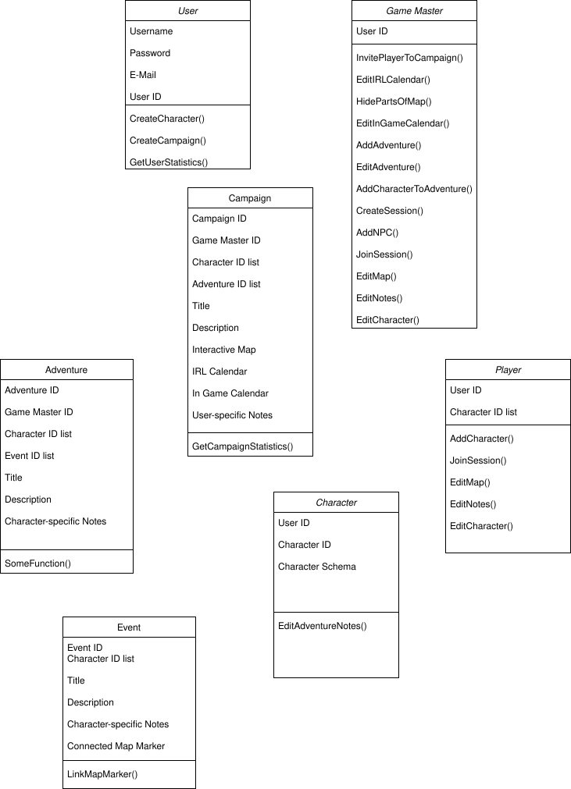

# Mind Map
The following mind map shows first thoughts on System relations.

Based on this, we can more concisely think about classes necessary to implement these ideas.

# Class Diagram

# Tech Stack
svelte-kit

Svelte

Node.js

tailwindcss

Docker

Database: propose document db, nicer integration of characters as files, no impedance mismatch

Map: leaflet.js due to popularity